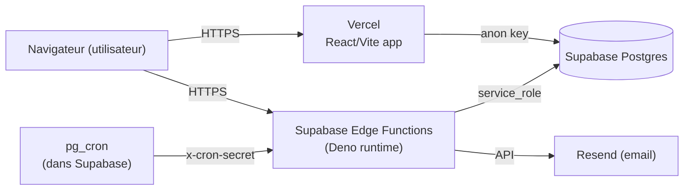

# Deploiement et configuration

Mode d'emploi operationnel pour deployer l'application apres la remediation
securite de mai 2026. Tous les fichiers et migrations referenced ici sont
deja presents dans le repo ; il reste essentiellement a provisionner des
secrets et a lancer un script SQL.

## 1. Architecture en deux runtimes

L'app tourne sur deux runtimes distincts qui se configurent separement.



- **Vercel** sert le bundle React au navigateur. Toutes les variables
  consommees par le code client sont prefixees `VITE_` et injectees au
  build. Elles sont **visibles publiquement** dans le bundle final.
- **Supabase Edge Functions** sont des scripts Deno qui tournent sur
  l'infrastructure Supabase. Ils lisent leur configuration via
  `Deno.env.get(...)`. Les secrets ne sont **jamais exposes au client**.

Consequence : ne jamais mettre une clef secrete dans une variable `VITE_*`,
elle finirait dans le bundle public.

## 2. Variables a provisionner

### 2.1. Cote Vercel (frontend)

Deja configurees dans le projet, listees ici pour reference complete.

| Variable | Exemple | Notes |
| -------- | ------- | ----- |
| `VITE_SUPABASE_URL` | `https://dazdotcdpudxpycodbbe.supabase.co` | URL du projet Supabase |
| `VITE_SUPABASE_PUBLISHABLE_KEY` | `eyJhbGciOi...` | Clef `anon` Supabase (lecture publique) |
| `VITE_EMAILJS_SERVICE_ID` | `service_xxx` | EmailJS (fallback envoi) |
| `VITE_EMAILJS_TEMPLATE_ID` | `template_xxx` | EmailJS |
| `VITE_EMAILJS_PUBLIC_KEY` | `xxx` | EmailJS |

Endroit : Vercel Dashboard -> Project -> Settings -> Environment Variables,
en cochant les environnements (Production / Preview / Development).

### 2.2. Cote Supabase (Edge Functions)

A ajouter / mettre a jour apres la remediation. Endroit : Supabase Dashboard
-> Project -> Project Settings -> Edge Functions -> Edge Function Secrets.

| Variable | Obligatoire | Exemple | A quoi ca sert |
| -------- | ----------- | ------- | -------------- |
| `SUPABASE_URL` | auto | (fourni par la plateforme) | Auto-injecte |
| `SUPABASE_SERVICE_ROLE_KEY` | auto | (fourni par la plateforme) | Auto-injecte |
| `SUPABASE_ANON_KEY` | auto | (fourni par la plateforme) | Auto-injecte |
| `RESEND_API_KEY` | oui | `re_xxx` | Envoi des emails (factures, devis, reset password, relances) |
| `RESEND_FROM` | recommande | `noreply@tech-trust.fr` | Adresse expediteur. **Domaine doit etre verifie dans Resend**. Si non defini, retombe sur `onboarding@resend.dev` (sandbox limite) |
| `CRON_SECRET` | oui (pour les crons) | chaine aleatoire 48+ chars | Header `x-cron-secret` exige par `cleanup-old-documents` et `send-payment-reminders`. Sans ce secret, les appels sont 401 |
| `PUBLIC_APP_URL` | recommande | `https://my-business-suite.vercel.app` | Base URL des recovery links envoyes par `admin-reset-password`. Defaut : Vercel deploy URL |
| `ALLOWED_ORIGINS` | optionnel | `https://app.tech-trust.fr,https://my-business-suite.vercel.app,http://localhost:5173` | CSV des origines autorisees par CORS. Defaut : Vercel + localhost |

#### Generer `CRON_SECRET`

```bash
openssl rand -base64 48
```

A copier dans Supabase secrets. Conserver une copie pour le SQL des crons
(section 3).

#### Verifier un domaine Resend

1. https://resend.com/domains -> Add Domain
2. Ajouter les enregistrements DNS (SPF + DKIM) chez le registrar
3. Attendre la validation (quelques minutes a quelques heures)
4. Une fois "Verified", on peut envoyer depuis n'importe quelle adresse
   `@ton-domaine.com`

## 3. Activation des crons

Pre-requis : extensions `pg_cron` et `pg_net` activees sur le projet.
Verifier dans Supabase Dashboard -> Database -> Extensions.

Le fichier [supabase/cron.sql](../supabase/cron.sql) contient les deux
`cron.schedule(...)` deja remplis avec le `project_ref` du projet. Avant
execution :

1. Ouvrir le fichier
2. Remplacer **les deux occurrences** de `LE_CRON_SECRET` par la valeur reelle
   provisionnee dans Supabase Edge Function Secrets (section 2.2)
3. Coller le contenu dans Supabase Dashboard -> SQL Editor -> New Query
4. Run

Verifier ensuite que les jobs apparaissent :

```sql
SELECT jobname, schedule, active FROM cron.job;
```

Pour tester manuellement une fonction cron :

```bash
curl -i \
  -H "x-cron-secret: LA_VALEUR_DU_SECRET" \
  -X POST \
  https://dazdotcdpudxpycodbbe.supabase.co/functions/v1/cleanup-old-documents
```

Reponse attendue : `200` avec `{"success": true, ...}`. Si `401`, c'est que
le secret ne matche pas.

## 4. Gestion des platform admins

Apres la remediation, **la seule source de verite est la table
`public.platform_admins`**. Plus de liste hardcodee dans le bundle, plus de
variable d'environnement.

Pour ajouter un platform admin (via Supabase Dashboard -> SQL Editor) :

```sql
INSERT INTO public.platform_admins (user_id, notes)
SELECT id, 'Ajout manuel YYYY-MM-DD'
FROM auth.users
WHERE lower(email) = 'utilisateur@example.com'
ON CONFLICT (user_id) DO NOTHING;
```

Pour le retirer :

```sql
DELETE FROM public.platform_admins
WHERE user_id = (SELECT id FROM auth.users WHERE lower(email) = 'utilisateur@example.com');
```

L'utilisateur verra/perdra l'onglet "Admin" cote Parametres au prochain
rafraichissement, et la fonction `admin-reset-password` honorera/refusera
les requetes en consequence.

## 5. Regressions UX

### 5.1. Auto-impression PDF

A l'origine de la remediation, l'auto-print etait casse cote N22. Le
patch suivant (lot "iframe-print" du plan de finitions) le restaure via
un iframe cache same-origin (cf. [src/lib/printPdf.ts](../src/lib/printPdf.ts)).
Comportement courant : clic sur "Imprimer" -> la dialog Cmd+P / Ctrl+P
apparait directement, plus de nouvel onglet.

### 5.2. Reset password admin

**Avant** : un admin pouvait reinitialiser un mot de passe et voir la valeur
generee en clair pour la communiquer manuellement.

**Apres** : la fonction `admin-reset-password` envoie un email avec un lien
de reinitialisation securise (valable 1 heure). Plus aucun mot de passe en
clair ne transite. L'utilisateur cible doit cliquer sur le lien dans son
email pour definir un nouveau mot de passe lui-meme.

Si l'utilisateur ne recoit pas l'email (spam, faute de frappe), l'admin
relance la procedure.

## 6. Checks post-deploiement

### 6.1. Divergence schema (`organization_roles` & helpers)

La migration `20260514101100_missing_functions_from_prod.sql` recree des
fonctions et une table qui existaient en prod mais n'etaient pas
versionnees. Lancer apres le `supabase db push` :

```bash
supabase db diff
```

Si la sortie est vide ou triviale (commentaires, ordre des colonnes) -> OK.
Si la sortie remonte des colonnes ou des conditions differentes, comparer
avec la prod et ajuster une migration de rattrapage.

### 6.2. Content-Security-Policy

Le fichier [vercel.json](../vercel.json) ajoute une CSP stricte. Apres
deploiement, ouvrir l'app, DevTools -> Console et chercher des messages
rouges du type :

```
Refused to connect to 'https://...' because it violates the following Content
Security Policy directive: connect-src ...
```

Si un service tiers est bloque (Sentry, PostHog, Stripe, Google Fonts...),
l'ajouter dans la directive concernee de [vercel.json](../vercel.json) :
`connect-src`, `script-src`, `img-src`, etc.

### 6.3. Storage : retrocompat URL / paths

La migration `20260514100600_storage_urls_to_paths.sql` convertit en place
les anciennes URLs publiques en paths. Le helper
[src/hooks/useSignedUrl.tsx](../src/hooks/useSignedUrl.tsx) accepte les
deux formes (`extractStoragePath`) le temps de la transition.

Smoke test : ouvrir une depense ancienne (avant la remediation) qui possede
un justificatif, cliquer pour l'ouvrir. Attendu : le fichier s'ouvre dans
un nouvel onglet via une URL signee. Si 404/403, c'est qu'un edge case n'a
pas ete couvert, regarder le path en DB et ajuster la migration.

### 6.4. Smoke test du reset password

1. Se connecter avec un compte platform_admin
2. Parametres -> Admin -> entrer un email d'un autre utilisateur de la
   meme org
3. Cliquer "Envoyer le lien"
4. Verifier dans la boite mail de l'utilisateur cible qu'un email Resend
   est arrive
5. Cliquer le lien, definir un nouveau mot de passe, se connecter

Si l'email n'arrive pas : verifier `RESEND_API_KEY` et `RESEND_FROM` cote
secrets Supabase, et regarder les logs de la fonction
`admin-reset-password` dans Supabase Dashboard -> Edge Functions -> Logs.

### 6.5. Smoke test des crons (manuels)

```bash
# cleanup-old-documents
curl -i -X POST \
  -H "x-cron-secret: $CRON_SECRET" \
  https://dazdotcdpudxpycodbbe.supabase.co/functions/v1/cleanup-old-documents

# send-payment-reminders
curl -i -X POST \
  -H "x-cron-secret: $CRON_SECRET" \
  https://dazdotcdpudxpycodbbe.supabase.co/functions/v1/send-payment-reminders
```

Si `401` : `CRON_SECRET` manquant ou incorrect cote Supabase secrets.
Si `200` mais 0 emails envoyes : c'est normal s'il n'y a pas de factures
en retard non relancees depuis 7 jours.

## 7. Aide-memoire deploiement

Sequence recommandee pour une mise en production a partir d'une branche
prete a merger :

1. **Supabase** : ajouter les secrets de la section 2.2 (au moins
   `CRON_SECRET`, `RESEND_FROM`, `PUBLIC_APP_URL`).
2. **Supabase** : `supabase db push` (depuis l'env CI ou local) pour
   appliquer les migrations 20260514*.
3. **Supabase** : verifier `supabase db diff` (section 6.1).
4. **Supabase** : ouvrir [supabase/cron.sql](../supabase/cron.sql),
   substituer `LE_CRON_SECRET`, executer dans le SQL editor.
5. **Vercel** : merge / push -> deploiement automatique.
6. Smoke tests (sections 6.2 a 6.5).
7. Si necessaire, ajuster la CSP et redeployer.
